# Telecom Customer Churn & Retention Intelligence

## From Churn Prediction to Retention Decisions

> **A churn model tells you who might leave. A retention intelligence system determines who should be prioritized, why they matter, when to intervene, and whether the intervention is economically justified.**

This project builds an end-to-end telecom churn and retention decision system that connects **data quality, exploratory analysis, statistical evidence, feature engineering, customer segmentation, supervised learning, hyperparameter optimization, ensemble modeling, model interpretation, customer value, and retention economics**.

The analytical journey is deliberately broader than classification:

**Predict → Prioritize → Intervene → Measure**

The final output is not only a churn probability. It is a ranked retention opportunity built from **risk + customer value + actionability + modeled economics**.

> **Scientific discipline:** the model predicts churn risk and the economic layer models expected value. Neither the retention intervention nor its ROI has been causally validated in an experiment.

---

## Executive Snapshot

<table>
<tr>
<td align="center"><strong>100K</strong><br/>customers</td>
<td align="center"><strong>100</strong><br/>raw fields</td>
<td align="center"><strong>22</strong><br/>engineered features</td>
<td align="center"><strong>5</strong><br/>model families</td>
</tr>
<tr>
<td align="center"><strong>50</strong><br/>Optuna trials</td>
<td align="center"><strong>0.6850</strong><br/>holdout PR-AUC</td>
<td align="center"><strong>91.0%</strong><br/>holdout recall</td>
<td align="center"><strong>1.59×</strong><br/>lift @ top 10%</td>
</tr>
</table>

**Champion:** `ValidationWeightedEnsemble`  
**Holdout:** 20,000 customers  
**Modeled Base Case:** 2,000 targeted customers → **$130K** campaign cost → **$783.7K** modeled net value → **6.03×** modeled ROI

### The project in one view


```mermaid
flowchart LR
    A["BUSINESS<br/>QUESTION"] --> B["DATA<br/>100K CUSTOMERS"]
    B --> C["STATISTICAL<br/>EVIDENCE"]
    C --> D["FEATURE<br/>ENGINEERING"]
    D --> E["ML<br/>MODELING"]
    E --> F["DECISION<br/>INTELLIGENCE"]
    F --> G["BUSINESS<br/>IMPACT"]

    classDef base fill:#24292f,color:#fff,stroke:#24292f;
    classDef decision fill:#0f8b8d,color:#fff,stroke:#0f8b8d;
    classDef outcome fill:#1a7f37,color:#fff,stroke:#1a7f37;
    class A,B,C,D,E base;
    class F decision;
    class G outcome;
```

The executive architecture is intentionally compact: it shows the complete analytical chain without turning the overview into a model catalog.

---

## 1. Why This Project Matters

Traditional churn analytics often stops at:

> **“This customer has a high probability of churning.”**

A retention team still needs to answer:

- Is the customer valuable enough to prioritize?
- Is there an actionable reason to intervene?
- What intervention should be considered?
- What does the intervention cost?
- What value could plausibly be preserved?

This project therefore separates **prediction** from **decisioning**:

**Churn risk** + **customer value** + **actionability** → **retention priority**

The distinction is central to the project. The classifier estimates risk; the decision layer determines how that risk can be translated into a constrained retention strategy.

---

## 2. Business Problem & Hypothesis

Telecom operators operate in a high-volume environment where customer acquisition is expensive and retention capacity is limited. The project focuses on an anonymous US telecom operator referred to in the source materials as **Company A**.

### Business question

> **Which customers should be prioritized for retention action, and what evidence supports that decision?**

### Primary hypothesis

The project investigates whether **device lifecycle / device age (`eqpdays`)** is strongly associated with churn and can therefore serve as an actionable intervention signal.

The reasoning is operational rather than causal:

**aging device → elevated observed churn risk → potential upgrade window → proposed retention intervention**

The analysis does **not** establish that device age causes churn or that an upgrade reduces churn. Those questions require treatment-effect measurement.

---

## 3. End-to-End Data Science Architecture

The project follows a complete analytical workflow rather than a single modeling notebook.

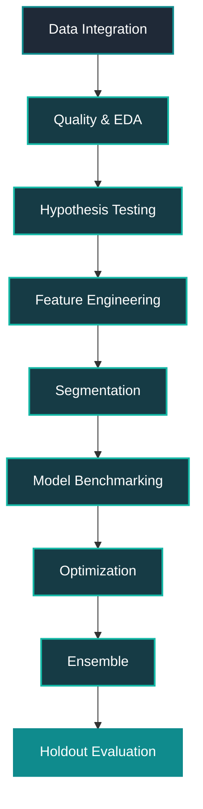
```mermaid
flowchart TB
    A["Data Integration"] --> B["Quality & EDA"]
    B --> C["Hypothesis Testing"]
    C --> D["Feature Engineering"]
    D --> E["Segmentation"]
    E --> F["Model Benchmarking"]
    F --> G["Optimization"]
    G --> H["Ensemble"]
    H --> I["Holdout Evaluation"]

    classDef source fill:#1f2937,color:#fff,stroke:#0f8b8d,stroke-width:2px;
    classDef process fill:#24292f,color:#fff,stroke:#4b5563,stroke-width:1.5px;
    classDef analytical fill:#163b45,color:#fff,stroke:#14b8a6,stroke-width:2px;
    classDef final fill:#0f8b8d,color:#fff,stroke:#0f8b8d,stroke-width:2px;
    class A source;
    class B,C,D,E,F,G,H analytical;
    class I final;
```

### Analytical stages

| Stage | What was performed |
|---|---|
| **Data integration** | `Client.csv` + `Record.csv` merged on `Customer_ID` |
| **Data quality** | Missingness, data types, distinct values, and issue-level audit |
| **EDA** | Target balance, device lifecycle, service friction, phones, revenue, correlations |
| **Statistics** | Two-sample Kolmogorov–Smirnov tests across key numeric variables |
| **Feature engineering** | 22 lifecycle, value, friction, behavioral, interaction, and segmentation features |
| **Segmentation** | KMeans `k=5` + diagonal-covariance GMM `k=5` |
| **Modeling** | Logistic Regression, Random Forest, XGBoost, LightGBM, CatBoost |
| **Optimization** | Optuna TPE, 50 trials, LightGBM objective optimized for validation PR-AUC |
| **Ensemble** | Validation-weighted blend of LightGBM, CatBoost, and optimized LightGBM |
| **Decision layer** | Risk + value + lifecycle/actionability → ranked retention targets |
| **Economics** | Scenario-based expected preserved value, campaign cost, net value, and ROI |

---

## 4. Data & Data Quality

### Source data

The repository contains two CSV sources:

- `telecom/Client.csv` — **100,000 rows × 50 columns**
- `telecom/Record.csv` — **100,000 rows × 51 columns**

They share `Customer_ID` and form a one-to-one customer-level modeling frame.

After merging:

- **100,000 customers**
- **100 raw fields**
- **0 duplicate customer IDs**
- binary target: `churn`
- churned: **49,562 (49.56%)**
- retained: **50,438 (50.44%)**

The target is therefore close to balanced, but **PR-AUC remains the primary ranking metric** because the business problem is targeted retention rather than generic accuracy maximization.

<p align="center">
  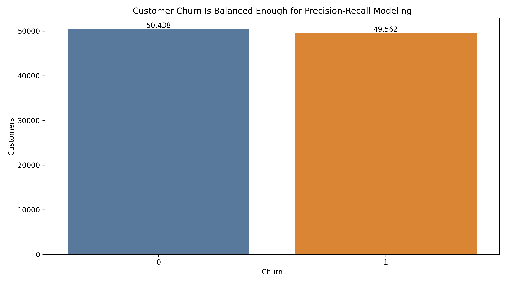
  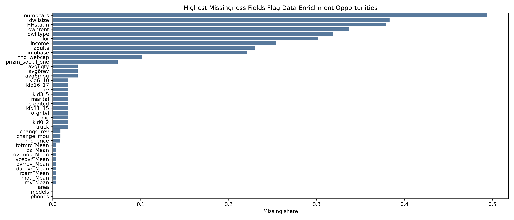
</p>

### Missingness profile

The largest missingness concentrations include:

| `numbcars` | `dwllsize` | `HHstatin` | `ownrent` | `dwlltype` | `lor` | `income` | `adults` | `infobase` | `hnd_webcap` |
|---:|---:|---:|---:|---:|---:|---:|---:|---:|---:|
| **49.37%** | **38.31%** | **37.92%** | **33.71%** | **31.91%** | **30.19%** | **25.44%** | **23.02%** | **22.08%** | **10.19%** |

The preprocessing strategy uses:

- numeric median imputation
- missing-value indicators
- categorical most-frequent imputation
- one-hot encoding
- scaling where required by the estimator

The complete column-level audit is retained in `outputs/tables/data_quality_report.csv`.

---

## 5. Exploratory Analysis & Statistical Evidence

The EDA was organized around four business themes:

1. **Device lifecycle** — whether aging devices correspond to higher churn.
2. **Service friction** — whether customer-care interaction is associated with churn.
3. **Customer value** — how revenue and usage relate to churn behavior.
4. **Account structure** — whether number of phones and related account characteristics differentiate customers.

### Exploratory evidence

<p align="center">
  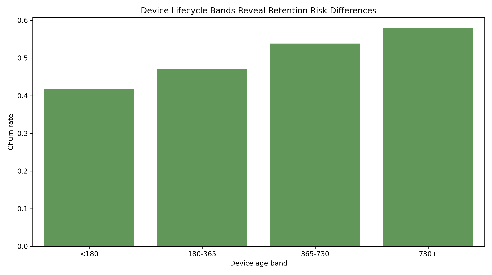
  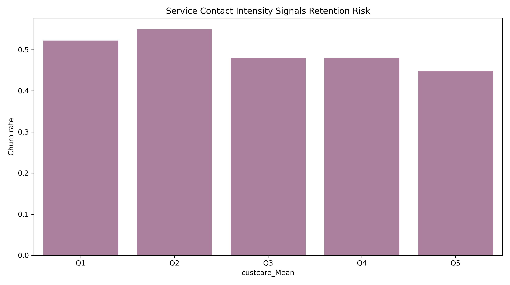
</p>
<p align="center">
  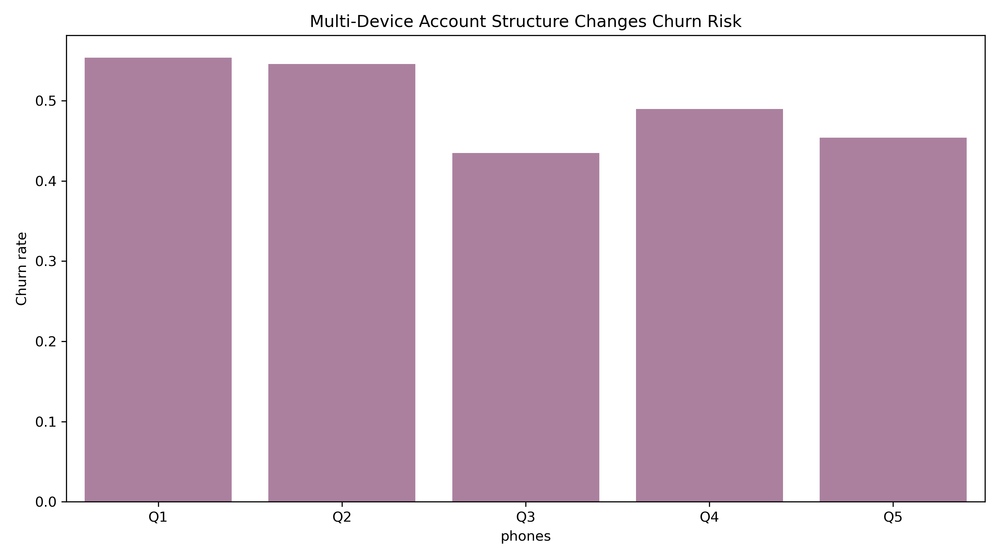
  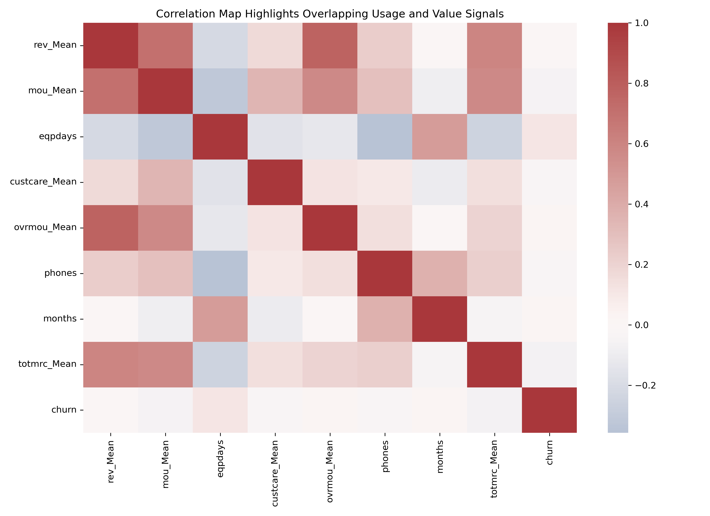
</p>

### Device lifecycle finding

Observed churn rises across the device-age bands:

| Device age | Observed churn |
|---|---:|
| `<180` days | 41.71% |
| `180–365` days | 46.93% |
| `365–730` days | 53.85% |
| `730+` days | 57.89% |

The `730+` group has approximately **1.39×** the observed churn rate of the `<180` group.

This is strong evidence of an association, but not proof of causality.

### Statistical testing

Two-sample KS tests were used to compare the distributions of selected numeric variables between churned and retained customers.

| Feature | KS D | Interpretation |
|---|---:|---|
| `eqpdays` | **0.1642** | strongest distributional separation |
| `months` | 0.1158 | meaningful separation |
| `totmrc_Mean` | 0.0761 | moderate separation |
| `mou_Mean` | 0.0542 | smaller separation |
| `custcare_Mean` | 0.0497 | smaller separation |
| `phones` | 0.0418 | smaller separation |
| `rev_Mean` | 0.0333 | small separation |
| `ovrmou_Mean` | 0.0254 | small separation |

With 100,000 observations, extremely small p-values are expected even for modest differences. For interpretation, the **KS statistic / effect size** is more informative than treating statistical significance alone as evidence of business importance.

> **Scientific caveat:** the analysis establishes association and distributional separation. It does not establish that device age causes churn, nor that a device upgrade causes retention.

---

## 6. Feature Engineering

The notebook creates **22 engineered features** in addition to the original modeling variables. They are grouped by decision purpose rather than listed as an undifferentiated feature dump.

| Category | Engineered features |
|---|---|
| **Lifecycle** | `device_age_band`, `eqpdays_months_interaction`, `eqpdays_per_month`, `device_age_relative` |
| **Customer value** | `clv_proxy`, `customer_value_score`, `revenue_per_phone`, `revenue_efficiency` |
| **Service friction** | `custcare_per_month`, `custcare_intensity`, `device_age_customer_care`, `revenue_customer_care`, `satisfaction_proxy` |
| **Behavior & revenue** | `overage_per_month`, `roaming_per_month`, `rev_per_mou`, `overage_intensity`, `roam_ratio`, `usage_efficiency` |
| **Account structure** | `multi_line_flag`, `overage_tenure` |
| **Segmentation** | `kmeans_segment`, `gmm_segment` |

The saved feature dictionaries provide the exact formulas and business meanings:

- `outputs/tables/feature_dictionary.csv`
- `outputs/tables/advanced_feature_dictionary.csv`

### Important feature definitions

- `clv_proxy = rev_Mean × months` — a historical customer-value proxy, not a full contractual CLV model.
- `customer_value_score` — a train-derived percentile composite of revenue, tenure, and phone count.
- `satisfaction_proxy = 1 / (1 + custcare_Mean + overage_intensity)` — a heuristic proxy, not a measured satisfaction score.
- `device_age_relative` — device age normalized against the training-set median.

These labels are intentionally qualified so that engineered proxies are not mistaken for directly observed business measures.

---

## 7. Leakage Prevention

The workflow uses a stratified **64% / 16% / 20% train / validation / test split** with seed `42`.

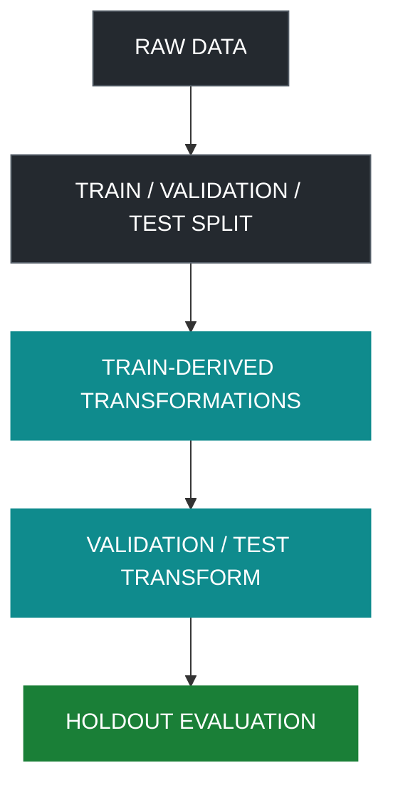
```mermaid
flowchart TB
    A["RAW DATA"] --> B["TRAIN / VALIDATION / TEST SPLIT"]
    B --> C["TRAIN-DERIVED TRANSFORMATIONS"]
    C --> D["VALIDATION / TEST TRANSFORM"]
    D --> E["HOLDOUT EVALUATION"]

    classDef source fill:#24292f,color:#fff,stroke:#57606a;
    classDef transform fill:#0f8b8d,color:#fff,stroke:#0f8b8d;
    classDef holdout fill:#1a7f37,color:#fff,stroke:#1a7f37;
    class A,B source;
    class C,D transform;
    class E holdout;
```

Leakage controls include:

- preprocessing is fit on training data before validation/test transformation
- percentile-based customer-value features use the training reference distribution
- device-age normalization uses the training median
- KMeans and GMM are fit on training data only
- validation is used to select ensemble weights and the decision threshold
- the final holdout is retained for evaluation

### Reproducibility nuance

The notebook source and saved artifacts reflect a completed project run, but the repository does not retain every transient checkpoint generated during execution. A fresh run can therefore regenerate files and exact model scores depending on the available compute environment.

---

## 8. Customer Segmentation

Segmentation is used as a **behavior/value lens**, not as a replacement for churn prediction.

### KMeans

- `k = 5`
- training-only fit
- standardized behavioral/value feature matrix
- `n_init = 20`

### Gaussian Mixture Model

- `5` components
- diagonal covariance
- training-only fit
- probabilistic cohort assignment

The fitted segmentation objects are retained in:

`outputs/models/customer_segmentation_models.joblib`

Segment profiles are available in:

`outputs/tables/customer_segment_profiles.csv`

The purpose is to identify customer cohorts with different combinations of churn, revenue, device age, and service behavior so that retention ranking can be interpreted in business context.

---

## 9. Model Development

Five model families were benchmarked:

- Logistic Regression
- Random Forest
- XGBoost
- LightGBM
- CatBoost

The benchmark uses **5-fold stratified cross-validation**, with PR-AUC as the primary model-selection lens.

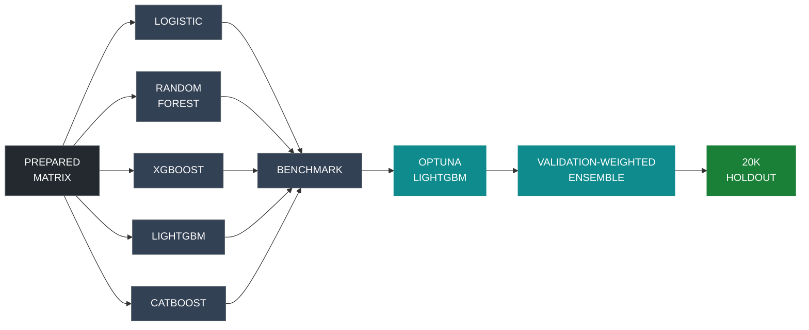
```mermaid
flowchart LR
    A["PREPARED<br/>MATRIX"] --> B["LOGISTIC"]
    A --> C["RANDOM<br/>FOREST"]
    A --> D["XGBOOST"]
    A --> E["LIGHTGBM"]
    A --> F["CATBOOST"]
    B --> G["BENCHMARK"]
    C --> G
    D --> G
    E --> G
    F --> G
    G --> H["OPTUNA<br/>LIGHTGBM"]
    H --> I["VALIDATION-WEIGHTED<br/>ENSEMBLE"]
    I --> J["20K<br/>HOLDOUT"]

    classDef input fill:#24292f,color:#fff,stroke:#57606a;
    classDef model fill:#334155,color:#fff,stroke:#57606a;
    classDef opt fill:#0f8b8d,color:#fff,stroke:#0f8b8d;
    classDef final fill:#1a7f37,color:#fff,stroke:#1a7f37;
    class A input;
    class B,C,D,E,F,G model;
    class H,I opt;
    class J final;
```

### Benchmark results

The repository's `model_benchmark_expanded.csv` records the following holdout results:

| Model | Test PR-AUC | Test ROC-AUC | F1 | Precision | Recall |
|---|---:|---:|---:|---:|---:|
| **LightGBM** | **0.6819** | **0.6950** | 0.6642 | 0.6089 | 0.7305 |
| **XGBoost** | 0.6818 | 0.6940 | 0.6837 | 0.5787 | 0.8353 |
| **CatBoost** | 0.6812 | 0.6930 | 0.6865 | 0.5754 | 0.8506 |
| Random Forest | 0.6572 | 0.6742 | 0.6549 | 0.5943 | 0.7292 |
| Logistic Regression | 0.6251 | 0.6450 | 0.6705 | 0.5245 | 0.9293 |

The benchmark demonstrates why model selection cannot be reduced to a single metric: the models trade precision, recall, and ranking quality differently.

---

## 10. Hyperparameter Optimization

LightGBM was selected for deeper optimization using **Optuna** with a **TPE sampler** and a **50-trial** budget.

The objective maximizes validation **PR-AUC**.

Key search dimensions include:

- `n_estimators`: 350–1200
- `learning_rate`: 0.015–0.12, log-scaled
- `num_leaves`: 24–128
- `max_depth`: 3–12
- `min_child_samples`: 20–220
- `subsample`: 0.65–1.00
- `colsample_bytree`: 0.65–1.00
- `reg_alpha`: `1e-4`–10
- `reg_lambda`: `1e-4`–10

The optimization history is retained as:

<p align="center">
  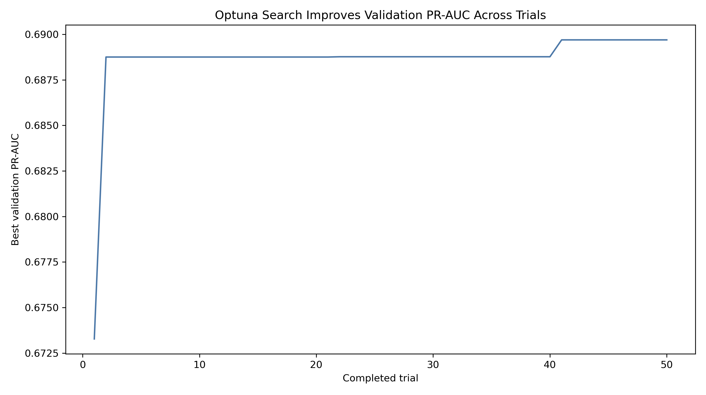
</p>

The saved Optuna artifact is:

`outputs/models/optuna_lightgbm.joblib`

The corresponding saved metrics are in:

`outputs/tables/optuna_final_metrics.csv`

### Saved Optuna result

| Metric | Value |
|---|---:|
| Test PR-AUC | **0.6843** |
| Test ROC-AUC | **0.6956** |
| F1 | **0.6895** |
| Precision | 55.49% |
| Recall | 91.02% |
| Threshold | 0.3411 |
| Validation PR-AUC | 0.6897 |
| Completed trials | 50 |

> **Implementation note:** the saved `optuna_final_metrics.csv` records `device_type=cpu`, while the current notebook source contains GPU flags for LightGBM. This is a reproducibility detail worth resolving before treating a fresh rerun as byte-for-byte equivalent to the retained artifact.

---

## 11. Ensemble Modeling

The final saved champion is a **validation-weighted ensemble**.

The ensemble search evaluates weight combinations on the validation set using PR-AUC and then selects the decision threshold using validation F1.

The retained `weighted_ensemble.joblib` records these non-zero weights:

| Component | Weight |
|---|---:|
| Optuna LightGBM | **80%** |
| LightGBM | **15%** |
| CatBoost | **5%** |

XGBoost participated in the ensemble search but received zero weight in the retained solution.

The saved champion artifact is:

`outputs/models/weighted_ensemble.joblib`

Its retained decision threshold is approximately **0.3415**.

### Why blend?

The benchmark models have similar ranking performance but different error profiles. Blending allows the final predictor to combine complementary probability estimates instead of relying entirely on one estimator family.

---

## 12. Final Model Performance

### Champion: `ValidationWeightedEnsemble`

The authoritative metrics reported by the **current notebook and retained model artifacts** are:

<table>
<tr>
<td align="center"><strong>0.6850</strong><br/>PR-AUC</td>
<td align="center"><strong>0.6956</strong><br/>ROC-AUC</td>
<td align="center"><strong>0.6895</strong><br/>F1</td>
</tr>
<tr>
<td align="center"><strong>55.49%</strong><br/>precision</td>
<td align="center"><strong>91.02%</strong><br/>recall</td>
<td align="center"><strong>1.59×</strong><br/>lift @ top 10%</td>
</tr>
</table>

**Decision threshold:** approximately `0.3415`  
**Evaluation set:** 20,000 holdout customers

<p align="center">
  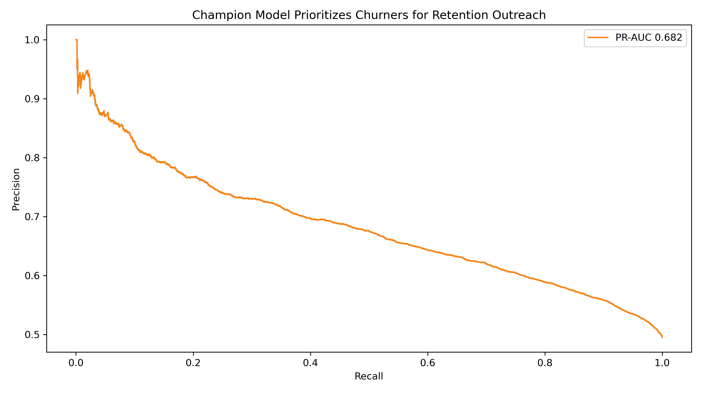
  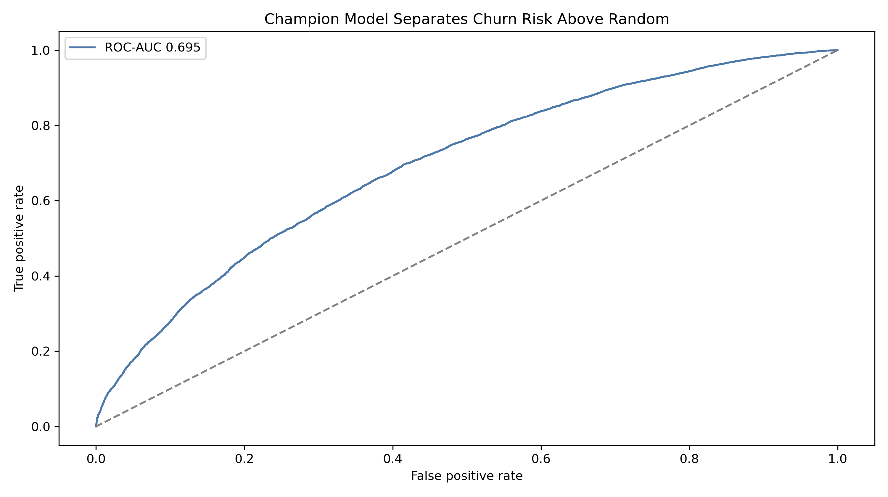
</p>
<p align="center">
  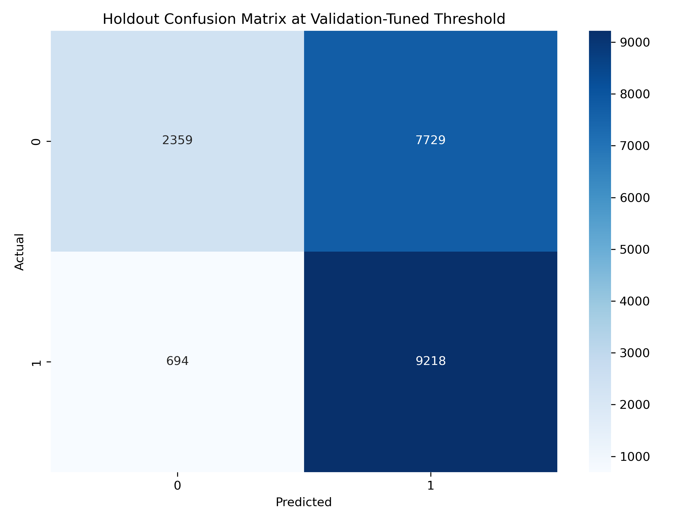
  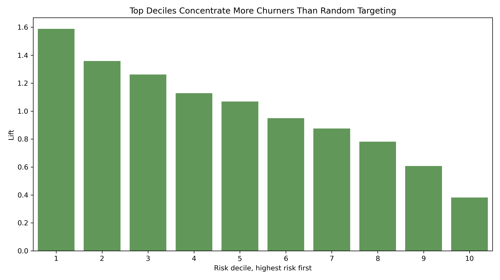
</p>

### How to read the result

The high recall reflects the project's retention objective: it is preferable to surface a broad set of potential churners when downstream retention action is available, rather than optimize for precision alone.

That trade-off also means the model should **rank customers and attach economics to the ranking**, rather than treating the classification threshold as the final business decision.

---

## 13. Model Interpretation

The project combines statistical evidence with model interpretation rather than treating feature importance as a substitute for analysis.

<p align="center">
  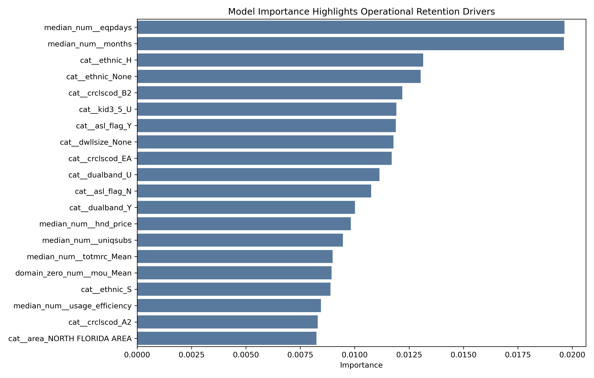
  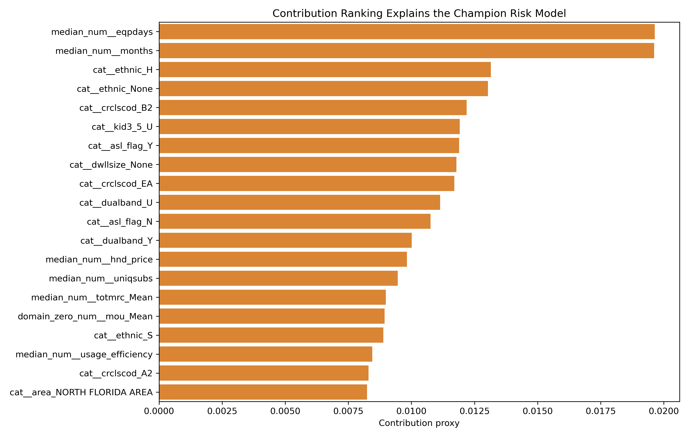
</p>

The saved feature-importance table is:

`outputs/tables/feature_importance.csv`

### Two different questions

**Statistical analysis asks:**

> Which variables show the strongest distributional separation between churned and retained customers?

Here, `eqpdays` is the strongest KS separator with **D = 0.1642**.

**Predictive modeling asks:**

> Which combination of variables helps the model rank churn risk accurately?

That broader signal includes usage, revenue, billing, customer-care, lifecycle, and engineered interaction variables.

This distinction prevents a common analytical mistake: assuming that the strongest univariate statistical separator must also be the only important predictive feature.

---

## 14. Device Lifecycle Discovery

Device age is the project's clearest analytical case study.

<p align="center">
  
</p>

The observed pattern is monotonic across the defined bands:

`<180` → `180–365` → `365–730` → `730+`

with churn increasing from **41.71%** to **57.89%**.

The notebook's business recommendation uses an operational lifecycle trigger around the **365-day** region, while the statistical analysis establishes that device age is associated with churn.

### What this means

**Evidence:** older devices correspond to higher observed churn.  
**Actionability:** device age can be monitored as a potential intervention trigger.  
**Causality:** not established by this project.

> The correct interpretation is **“device age is an actionable predictive signal”**, not **“device aging causes churn.”**

---

## 15. Decision Intelligence

This is the project's signature layer: the model's probability becomes a retention decision only after risk is combined with customer value and actionability.

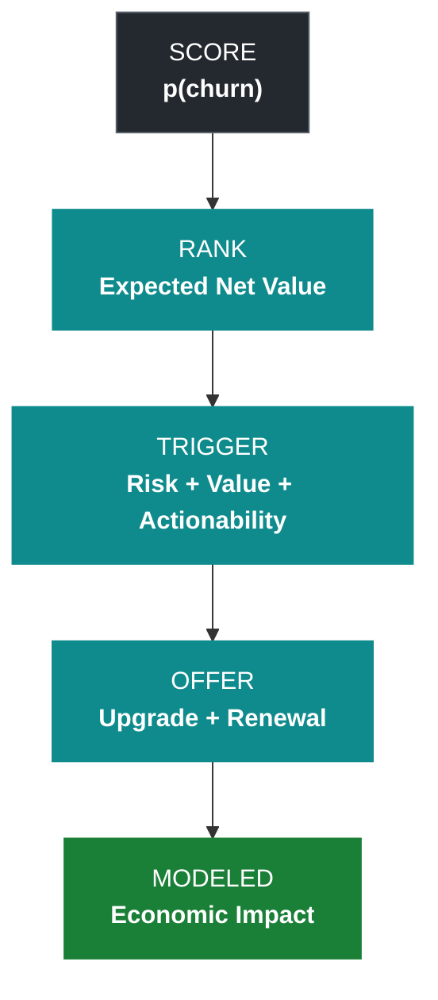
```mermaid
flowchart TB
    A["SCORE<br/><b>p(churn)</b>"] --> B["RANK<br/><b>Expected Net Value</b>"]
    B --> C["TRIGGER<br/><b>Risk + Value + Actionability</b>"]
    C --> D["OFFER<br/><b>Upgrade + Renewal</b>"]
    D --> E["MODELED<br/><b>Economic Impact</b>"]

    classDef score fill:#24292f,color:#fff,stroke:#57606a;
    classDef decision fill:#0f8b8d,color:#fff,stroke:#0f8b8d;
    classDef outcome fill:#1a7f37,color:#fff,stroke:#1a7f37;
    class A score;
    class B,C,D decision;
    class E outcome;
```

### 1. SCORE

The ensemble produces a predicted churn probability:

`p_churn`

This is the model's estimate of risk, not an estimate of treatment response.

### 2. RANK

Customers are ranked using **expected net value**, so the system can distinguish between:

- high-risk / low-value customers
- high-risk / high-value customers
- lower-risk / high-value customers
- customers where the intervention is unlikely to be economically attractive

### 3. TRIGGER

The operational decision layer combines:

- predicted churn risk
- customer value
- device lifecycle
- service-friction signals
- campaign economics

The notebook recommendation emphasizes the top decile by expected net value and device age above the lifecycle threshold, with service recovery considered for high `custcare_Mean` accounts.

### 4. OFFER

The modeled intervention is a **subsidized device upgrade + contract renewal**, with service recovery as an additional action for relevant accounts.

This is a proposed intervention, not an experimentally validated treatment.

<p align="center">
  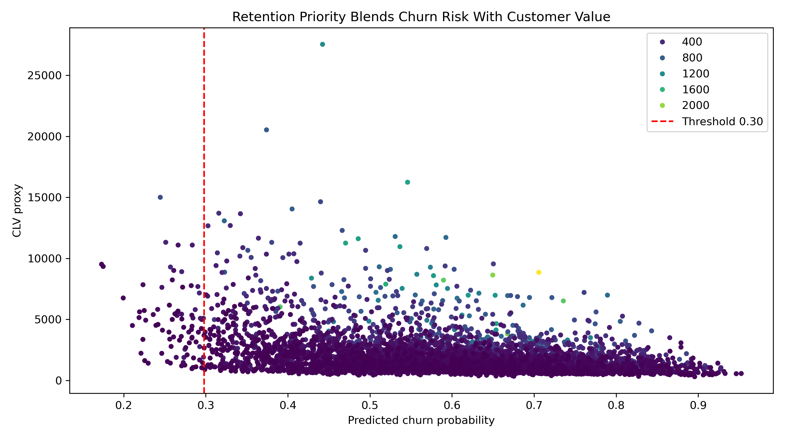
</p>

---

## 16. Expected-Value Framework

The decision layer converts churn risk into an economic ranking.

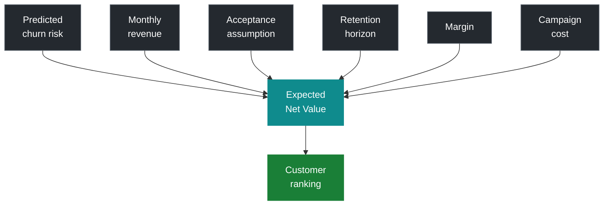
```mermaid
flowchart TB
    A["Predicted<br/>churn risk"] --> F["Expected<br/>Net Value"]
    B["Monthly<br/>revenue"] --> F
    C["Acceptance<br/>assumption"] --> F
    D["Retention<br/>horizon"] --> F
    E["Margin"] --> F
    G["Campaign<br/>cost"] --> F
    F --> H["Customer<br/>ranking"]

    classDef input fill:#24292f,color:#fff,stroke:#57606a;
    classDef value fill:#0f8b8d,color:#fff,stroke:#0f8b8d;
    classDef output fill:#1a7f37,color:#fff,stroke:#1a7f37;
    class A,B,C,D,E,G input;
    class F value;
    class H output;
```

### Formula

```text
expected_preserved_value
= p_churn
  × acceptance_rate
  × retained_months
  × monthly_revenue
  × gross_margin_multiplier
```

Then:

```text
expected_net_value
= expected_preserved_value − campaign_cost
```

The result is a **scenario-based economic prioritization score**, not a causal revenue forecast.

### Observed vs assumed

| Observed / modeled from data | Assumed for scenario planning |
|---|---|
| `p_churn` | acceptance rate |
| `rev_Mean` | retained months |
| customer ranking | subsidy cost |
| top-decile targeting | marketing cost |
| churn lift | gross-margin multiplier |

This separation is essential: the model supplies risk and customer-level information; the business scenario supplies assumptions about what happens after intervention.

---

## 17. Modeled Business Impact

The business layer evaluates three scenarios using the top 10% of the holdout population by expected net value.

<p align="center">
  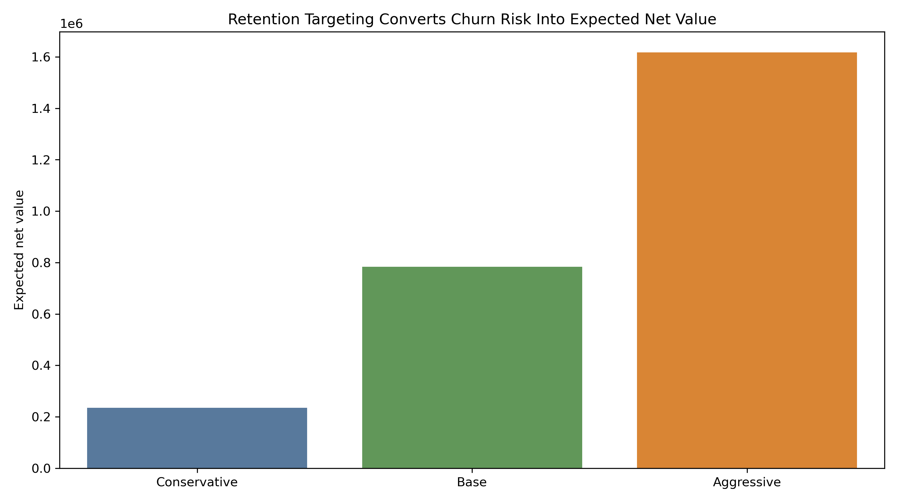
</p>

### Scenario summary

| Scenario | Targeted | Acceptance | Retained months | Campaign cost | Net value | ROI |
|---|---:|---:|---:|---:|---:|---:|
| Conservative | 2,000 | 20% | 12 | $90,000 | $234,874 | 2.61× |
| **Base** | **2,000** | **30%** | **18** | **$130,000** | **$783,707** | **6.03×** |
| Aggressive | 2,000 | 40% | 24 | $170,000 | $1,616,804 | 9.51× |

### Base scenario

**2,000 targeted customers**  
→ **$130K campaign cost**  
→ **$913.7K modeled gross preserved value**  
→ **$783.7K modeled net value**  
→ **6.03× modeled ROI**

> **MODELED — NOT REALIZED**

These figures are scenario outputs generated from assumptions. They should not be presented as revenue already generated or ROI already achieved.

The source table is:

`outputs/tables/business_impact_summary.csv`

---

## 18. Production Thinking

The project intentionally distinguishes what exists in the current repository from what would be required for production deployment.

| Area | Current project | Production requirement |
|---|---|---|
| Scoring | Saved ensemble artifact | Scheduled scoring service / batch job |
| Preprocessing | Saved preprocessor | Versioned feature pipeline |
| Monitoring | Not implemented | Drift, calibration, performance monitoring |
| Calibration | Not established as a production control | Calibration analysis and monitoring |
| Experimentation | Not implemented | Randomized treatment/control testing |
| Uplift | Not implemented | Individual treatment-effect / uplift modeling |
| Governance | Analytical documentation | Model registry, approvals, audit trail |
| Privacy | Source data currently present in archive | Formal data-access and retention controls |

The project therefore demonstrates **production thinking** without claiming to be a production deployment.

---

## 19. Limitations

### 1. Modeled, not realized, financial impact

ROI depends on assumptions for acceptance, retained months, margin, and intervention cost.

### 2. No causal treatment effect

High churn probability does not mean an intervention will reduce churn.

### 3. No live A/B experiment

The project does not contain randomized treatment/control outcomes.

### 4. Probability calibration

The primary emphasis is ranking performance. Production deployment should validate calibration if probabilities are used as economically meaningful probabilities.

### 5. Deployment

No live scoring service, monitoring stack, model registry, or production feature store is included.

### 6. Dataset generalization

The source is an anonymized historical telecom dataset associated with an anonymous operator. Performance should be revalidated against current operational data before deployment.

---

## 20. Future Roadmap

### Phase 1 — Productionization

- package preprocessing + scoring into a versioned pipeline
- schedule batch scoring
- add model registry and artifact versioning
- add monitoring and alerting

### Phase 2 — Model Reliability

- probability calibration
- subgroup performance checks
- drift monitoring
- threshold stability analysis
- model retraining policy

### Phase 3 — Causal Measurement

- define eligible retention population
- randomize treatment/control groups
- measure incremental retention
- measure incremental revenue and intervention cost

### Phase 4 — Uplift Modeling


```mermaid
flowchart LR
    A["ELIGIBLE<br/>CUSTOMERS"] --> B["RANDOMIZED<br/>TREATMENT / CONTROL"]
    B --> C["RETENTION<br/>OUTCOMES"]
    C --> D["INCREMENTAL<br/>EFFECT"]
    D --> E["UPLIFT<br/>MODEL"]
    E --> F["OPTIMIZED<br/>INTERVENTION"]

    classDef base fill:#24292f,color:#fff,stroke:#57606a;
    classDef future fill:#0f8b8d,color:#fff,stroke:#0f8b8d;
    class A,B,C,D base;
    class E,F future;
```

The causal roadmap is explicitly **future work**. It is the natural next step for answering the question the current project cannot answer: **who is actually persuadable by the intervention?**

---

## 21. End-to-End Data Science Scope

| Capability | Evidence in the project |
|---|---|
| **Data Engineering** | Two-source integration, schema inspection, customer-level merge |
| **Data Quality** | Missingness profiling, column-level quality report, preprocessing controls |
| **Statistics** | Two-sample KS tests and effect-size-oriented interpretation |
| **EDA** | Target balance, lifecycle, service, revenue, phone-count, correlation analysis |
| **Feature Engineering** | 22 engineered lifecycle, value, friction, behavioral, interaction, and segment features |
| **Unsupervised Learning** | KMeans `k=5`, Gaussian Mixture Model `k=5` |
| **Supervised Learning** | Logistic Regression, Random Forest, XGBoost, LightGBM, CatBoost |
| **Optimization** | Optuna TPE, 50-trial LightGBM search |
| **Ensemble Learning** | Validation-weighted probability blend |
| **Evaluation** | PR-AUC, ROC-AUC, F1, precision, recall, threshold, lift, confusion matrix |
| **Interpretation** | Feature importance, SHAP summary, logistic coefficients, statistical evidence |
| **Decision Science** | Risk/value/actionability ranking and retention trigger logic |
| **Business Analytics** | Expected preserved value, campaign cost, net value, scenario ROI |
| **Production Thinking** | Leakage controls, reproducibility, privacy, monitoring roadmap, causal roadmap |

This breadth is intentional: the project covers the full path from **raw customer data to an economically framed decision**.

---

## 22. Technology Stack

**Language**  
Python 3.11/3.12 target environment

**Data & Scientific Computing**  
Pandas · NumPy · SciPy

**Visualization**  
Matplotlib · Seaborn

**Machine Learning**  
Scikit-learn · XGBoost · LightGBM · CatBoost

**Optimization**  
Optuna / TPE

**Model Persistence**  
Joblib

**Notebook / Analysis**  
Jupyter Notebook

**Data Artifacts**  
CSV · Parquet checkpoints generated during execution

Dependencies are pinned in `requirements.txt`.

---

## 23. Repository Structure

The following structure is verified against the supplied repository archive:

```text
.
├── README.md
├── requirements.txt
├── .gitignore
│
├── notebooks/
│   └── YasminWalid.ipynb
│
├── telecom/
│   ├── Client.csv
│   └── Record.csv
│
├── outputs/
│   ├── figures/
│   │   ├── 01_missingness_profile.png
│   │   ├── 02_target_balance.png
│   │   ├── 03_eda_device_age_churn.png
│   │   ├── 04_eda_new_cell_churn.png
│   │   ├── 05_eda_custcare_churn.png
│   │   ├── 06_eda_phones_churn.png
│   │   ├── 07_eda_revenue_churn.png
│   │   ├── 08_correlation_heatmap.png
│   │   ├── 09_model_precision_recall.png
│   │   ├── 10_model_roc_curve.png
│   │   ├── 11_confusion_matrix.png
│   │   ├── 12_lift_chart.png
│   │   ├── 13_xgb_feature_importance.png
│   │   ├── 14_logistic_coefficients.png
│   │   ├── 15_shap_summary_bar.png
│   │   ├── 16_business_roi_waterfall.png
│   │   ├── 17_priority_scatter.png
│   │   └── 18_optuna_optimization_history.png
│   │
│   ├── models/
│   │   ├── advanced_preprocessor.joblib
│   │   ├── customer_segmentation_models.joblib
│   │   ├── optuna_lightgbm.joblib
│   │   └── weighted_ensemble.joblib
│   │
│   └── tables/
│       ├── advanced_feature_dictionary.csv
│       ├── business_impact_summary.csv
│       ├── customer_segment_profiles.csv
│       ├── data_quality_report.csv
│       ├── feature_dictionary.csv
│       ├── feature_importance.csv
│       ├── model_benchmark_expanded.csv
│       ├── model_comparison.csv
│       ├── optuna_final_metrics.csv
│       └── top_risk_customers.csv
│
├── docs/
│   ├── Telecom_Dataset_Intelligence_Report.md
│   └── business_driver_report.md
│
└── deliverables/
    ├── Project_Horizon_Board_Presentation.pptx
    └── YasminWalid.pdf
```

### Where to start

| Need | Start here |
|---|---|
| Understand the full workflow | `notebooks/YasminWalid.ipynb` |
| Inspect data quality | `outputs/tables/data_quality_report.csv` |
| Inspect feature definitions | `outputs/tables/advanced_feature_dictionary.csv` |
| Compare models | `outputs/tables/model_benchmark_expanded.csv` |
| Inspect optimized LightGBM | `outputs/tables/optuna_final_metrics.csv` + `outputs/models/optuna_lightgbm.joblib` |
| Inspect final ensemble | `outputs/models/weighted_ensemble.joblib` |
| Inspect retention economics | `outputs/tables/business_impact_summary.csv` |
| Read dataset context | `docs/Telecom_Dataset_Intelligence_Report.md` |
| Read business interpretation | `docs/business_driver_report.md` |

---

## 24. Reproducibility

### Environment

Create an isolated Python environment and install the pinned requirements:

```bash
python -m pip install -r requirements.txt
```

### Run

From the repository root, open:

```text
notebooks/YasminWalid.ipynb
```

The notebook uses deterministic seed:

```text
42
```

The intended split is:

```text
64,000 train
16,000 validation
20,000 holdout test
```

### Required data

The notebook expects:

```text
telecom/Client.csv
telecom/Record.csv
```

### Compute

The notebook contains GPU-related configuration for LightGBM/XGBoost in parts of the modeling workflow, but the retained Optuna metrics artifact records CPU execution. A fresh environment should therefore verify the actual available device configuration before comparing results directly with the saved artifacts.

### Reproducibility limitation

A deterministic seed does not guarantee identical results across different library builds, hardware, GPU/CPU backends, or reruns that regenerate optimization artifacts. The committed model artifacts and CSV outputs should be treated as the evidence for the supplied run.

---

## 25. Data Privacy

The current supplied repository archive **does contain the two source CSV files** under `telecom/` and the generated `top_risk_customers.csv` contains customer-level scored records.

That means the present archive should **not automatically be treated as a public-safe release** merely because the source describes the operator as anonymous.

Before publishing this repository publicly, review:

- whether `Client.csv` and `Record.csv` are licensed for redistribution
- whether customer-level fields should be removed
- whether `Customer_ID` should be excluded
- whether `outputs/tables/top_risk_customers.csv` should be removed or anonymized
- whether generated model artifacts encode information that requires access controls

For a public portfolio release, the safer pattern is to retain the **methodology, aggregate results, figures, model documentation, and synthetic or approved sample data**, while excluding restricted customer-level records.

---

## 26. Results & Versioning Note

### Authoritative current-run sources

For the repository supplied with this README, the strongest sources of truth are:

1. `notebooks/YasminWalid.ipynb`
2. `outputs/models/weighted_ensemble.joblib`
3. `outputs/tables/optuna_final_metrics.csv`
4. `outputs/tables/model_benchmark_expanded.csv`
5. `outputs/tables/business_impact_summary.csv`

### Metric reconciliation

An earlier README iteration referenced a different set of headline values, including **0.687082 PR-AUC**, **0.697498 ROC-AUC**, **93.12% recall**, threshold **0.3084**, and a **$785,205 / 6.04×** base-case result.

Those exact values are **not present in the current repository's authoritative notebook/output artifacts**. The current notebook and saved artifacts instead report approximately:

- **0.685036 holdout PR-AUC**
- **0.695620 holdout ROC-AUC**
- **0.689465 F1**
- **55.49% precision**
- **91.02% recall**
- **~0.3415 retained ensemble threshold**
- **1.59× lift @ top 10%**
- **$783,707 modeled base net value**
- **6.03× modeled base ROI**

This README intentionally uses the **repository-backed values** rather than silently carrying forward stale numbers.

---

## 27. References

### Project documentation

- [`docs/Telecom_Dataset_Intelligence_Report.md`](docs/Telecom_Dataset_Intelligence_Report.md)
- [`docs/business_driver_report.md`](docs/business_driver_report.md)
- [`notebooks/YasminWalid.ipynb`](notebooks/YasminWalid.ipynb)

### Technical references

- Scikit-learn — model evaluation, preprocessing, pipelines, clustering
- LightGBM — gradient boosting framework
- XGBoost — gradient boosting framework
- CatBoost — categorical-aware gradient boosting framework
- Optuna — hyperparameter optimization
- SHAP — model explanation framework

### GitHub rendering

This README uses standard GitHub-flavored Markdown, HTML image sizing, tables, and Mermaid code fences. GitHub supports Mermaid diagrams directly inside Markdown files.

---

## Final Takeaway

> **Predicting churn is useful. Knowing whom to prioritize, when to act, and whether the intervention is worth paying for is more useful.**

**Telecom Customer Churn & Retention Intelligence** connects:

**Business Problem → Data → Evidence → Modeling → Validation → Decision → Business Impact**

It demonstrates an end-to-end Data Science workflow in which machine learning is not the endpoint. The endpoint is a **defensible decision framework** that combines statistical evidence, predictive risk, customer value, operational triggers, and scenario-based retention economics—while keeping causal claims and financial impact appropriately qualified.
